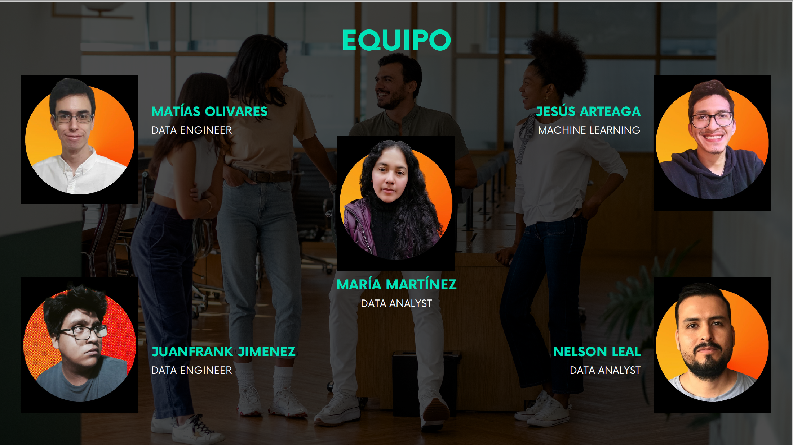

## &nbsp;&nbsp;&nbsp;&nbsp;&nbsp;&nbsp;&nbsp;&nbsp;&nbsp;&nbsp;&nbsp;&nbsp;&nbsp;&nbsp;&nbsp;&nbsp;&nbsp;&nbsp;&nbsp;&nbsp;&nbsp;&nbsp;&nbsp;&nbsp;&nbsp;&nbsp;&nbsp;&nbsp;&nbsp;&nbsp;&nbsp;&nbsp;&nbsp;&nbsp;&nbsp;&nbsp;&nbsp;&nbsp;&nbsp;&nbsp;&nbsp;&nbsp;&nbsp;&nbsp;&nbsp;&nbsp;&nbsp;&nbsp;                                                                                                      Hola!, Soy M. Guadalupe (Cora) 

## Quién soy?
Soy una persona responsable, con
un interés por el análisis de datos.
Poseo una maestría en ciencias de la
ingeniería y actualmente estoy en la
etapa final de un bootcamp en Data
Science en Soy Henry, donde he
adquirido sólidos conocimientos en
el área de datos.

## Contacto
e-mail: cora12@live.com.mx

linkedIn: https://www.linkedin.com/in/mar%C3%ADa-guadalupe-mart%C3%ADnez-1a489173/
<!--
**Cora1218/Cora1218** is a ✨ _special_ ✨ repository because its `README.md` (this file) appears on your GitHub profile.

Here are some ideas to get you started:

- 🔭 I’m currently working on ...
- 🌱 I’m currently learning ...
- 👯 I’m looking to collaborate on ...
- 🤔 I’m looking for help with ...
- 💬 Ask me about ...
- 📫 How to reach me: ...
- 😄 Pronouns: ...
- ⚡ Fun fact: ...
--> 
## Herramientas y Lenguajes de programación 
<table><tr>

 
 
  
  
 
  

  
 
  
  
  
  
  
</tr></table> 

## Proyectos 

- Sistema de recomendación de restaurantes a base de reseñas de google maps y yelp de USA.
  Se hizo un analisis de las reseñas de los usuarios de las plataformas Google Maps y Yelp sobre restaurantes para visualizar por medio de un dashboard los 
  indicadores de rendimiento clave (KPI, por sus siglas en inglés) para tomar decisiones y mejorar estrategias que beneficien a los empresarios de este 
  sector gastronómico. 

  Asimismo, se desarrolló un sistema de recomendación para los usuarios de ambas plataformas capaz de recomendar restaurantes y platillos similares basados 
  en experiencias de consumo previo.

### Tareas realizadas:
    
    Creación de un Data Lake en Cloud Storage co la data en crudo.

    Desarrollo de Extracción, Transformación y Carga de datos (ETL, por sus siglas en inglés).

    Elaboración de Diagrama de Entidad y Relación (DER) y diccionario de datos.

    Creación de una base de datos (Data Warehouse) con Big Query.

    Análisis y diseño de dashboard con KPIs relevantes en Power BI del top 5 estados más poblados.

    Entrenamiento y puesta en producción de un modelo de machine learning (ML).

    Documentación.

    Creación de repositorio en GitHub.

    Presentación con storytelling.

### Metodología:
    
    SCRUM

### Herramientas:

    Google Drive
    
    Jira

    Visual studio code (VSC)
    
    Python

    Pandas, numpy, matplotlib
    
    Google Cloud Platform (GCP) 

    Power BI
    
### Equipo de trabajo: 

